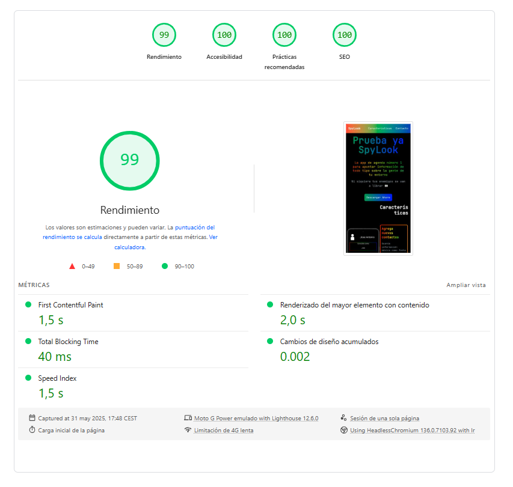
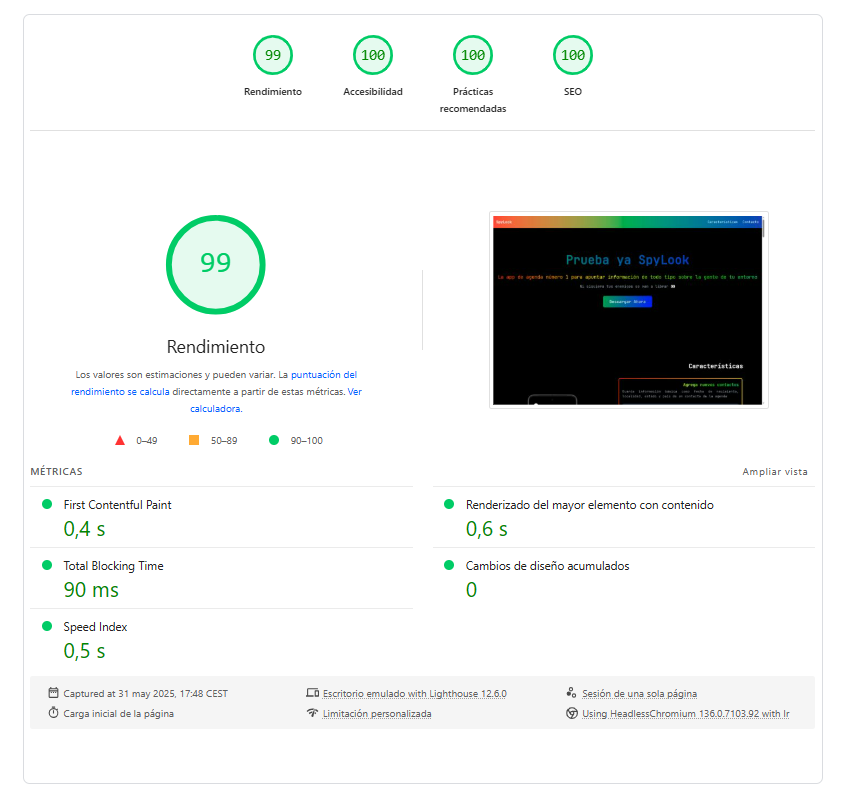

[](https://github.com/cdominguezh06)
[](https://cdominguezh06.github.io/spylook-web/)
[](https://github.com/cdominguezh06/spylook)
[](https://angular.dev)

# SpyLook Web 👀

Este proyecto consiste en dotar a [SpyLook](https://github.com/cdominguezh06/spylook) de una página web desde la que conocer la aplicación a fondo y ofrecer enlaces de descarga,
conectandose a la API REST de GitHub y listando todos los releases publicados en el repositorio hasta la fecha


# Funcionamiento de la web

La web está construida utilizando [Angular 19.2.11](https://v19.angular.dev), con TailwindCSS aportando clases de CSS predefinidas
para estilar la página

Además se ha hecho uso de [AngularCLI GhPages](https://www.npmjs.com/package/angular-cli-ghpages) para el deploy de la página web en
GitHub Pages, ofreciendo así un hosting gratuito lo suficientemente maleable para este proyectoo


# Estructura

La estructura de la página web está dividida en varios componentes de Angular:
```
components/
 ├── download/        # El release más reciente de la aplicación
 ├── features/        # Imagen de la aplicación que cambia según la característica sobre la que poses el ratón
 ├── footer/          # Pie de página
 ├── header/          # Cabecera de la página con enlace a repositorio, apartado de características y perfil de GitHub
 ├── hero/            # Banner de inicio de la página, con botón de CTA (Call To Action) que lleva al componente download
 └── timeline/        # Lista de todos los releases de la aplicación, ordenados de más reciente a más antiguo
```

A su vez, el proyecto cuenta con los siguientes directorios adicionales:

```
app/
 ├── pipes/
 │    └── replace-tags.pipe.ts        # Clase que acepta un texto en Markdown sin formatear 
 │                                      y reemplaza el etiquetado Markdown por etiquetas HTML estiladas
 └── services/
      ├── global-effects.service.ts   # Servicio que aplica animaciones y efectos interactivos a elementos del DOM
      └── git-hub.service.ts          # Servicio que toma de la API REST de GitHub el historial de releases de SpyLook
```

# Componentes

A continuación se detalla el funcionamiento de cada componente en orden de aparición

## HeaderComponent

Todo su contenido es almacenado en una etiqueta `<header>` con un efecto de arcoíris como color de fondo
Cuenta con un título `<h1>` que redirige al repositorio de la app de Android y un elemento `<nav>` con enlaces
al apartado de características y al perfil de GitHub


## HeroComponent

Todo su contenido se almacena en una etiqueta `<section>` con fondo negro. 
El título `<h1>` es modificado por `global-effects.service.ts` para tener un color arcoíris cuyo
color rojo sigue la posición del ratón al posicionarse sobre este

## FeaturesComponent

Section que almacena una imagen y varios `<div>` con la clase CSS `gradient-border` para que `global-effects.service.ts`
aplique un efecto de gradiente interactivo al borde de los elementos

Estos `<div>` cuentan con un pequeño *snippet* de código para mostrar parte de la funcionalidad de la característica que detallan

## DownloadComponent

Section que muestra el release más reciente de la aplicación sacado desde la API REST de GitHub mediante
`git-hub.service.ts`. Muestra a su vez las notas de la versión, tratando el texto Markdown con `replace.tags.pipe.ts`
para mostrar un texto estilado con etiquetas HTML

## TimelineComponent

Section que se conecta a la API REST de GitHub mediante `git-hub.service.ts` y muestra todos los releases
anteriores al mostrado en `download.component.html`. Al igual que el componente anterior, trata el texto Markdown
de las notas de la versión con `replace.tags.pipe.ts`

## FooterComponent

Pie de página con fondo de arcoíris


# Deploy

El deploy se lleva a cabo mediante la libreria NPM de [AngularCLI GhPages](https://www.npmjs.com/package/angular-cli-ghpages)
que, como bien se explicó al inicio, hace uso de GitHub Pages para hospedar la página web


El comando para realizar el deploy es el siguiente
```bash
ng deploy --base-href="https://cdominguezh06.github.io/spylook-web/"
```

Este comando genera los archivos estáticos de la página mediante ng build y los sube a GitHub Pages, el cual
sirve la página bajo un dominio gratuito y con protocolo HTTPS

> [!Note]
> Usar archivos estáticos (HTML,CSS y JS) permite reducir el tiempo de carga de la página web

También se ha registrado la página en [Google Search Console](https://search.google.com/search-console/about) para facilitar el indexado de la misma
en el buscador de Google

Actualmente las búsquedas que mejor posicionan la página son
1. SpyLook agenda (primera posición)
2. SpyLook android (tercera posición)
3. SpyLook app (cuarta posición)

A su vez, buscar una captura de pantalla de la aplicación en Google Lens dará como primer resultado la página web

# Métricas de rendimiento web

Haciendo uso de [PageSpeed Insights](https://pagespeed.web.dev) se pueden obtener métricas de rendimiento, accesibilidad,
prácticas recomendadas y SEO sobre la página web, haciendo una prueba para la versión de dispositivos móviles y otra para
dispositivos de escritorio

El resultado de las métricas es el siguiente:
### Móvil 

  

### Escritorio

  
